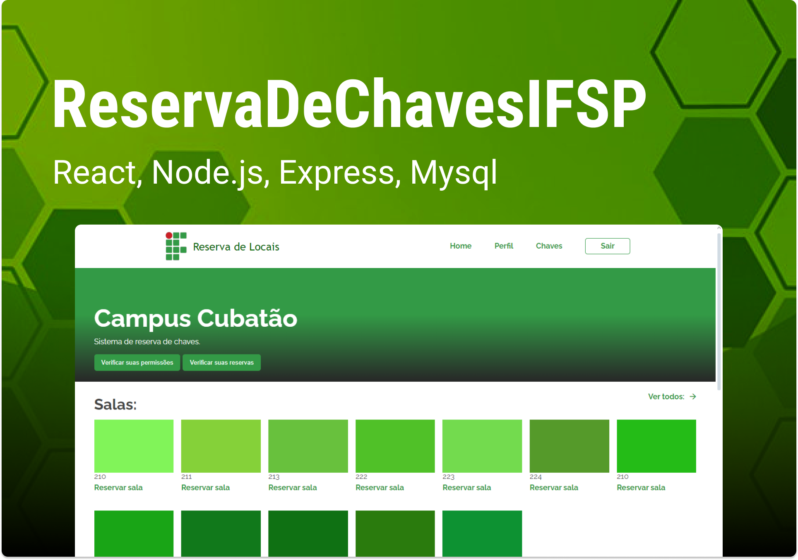
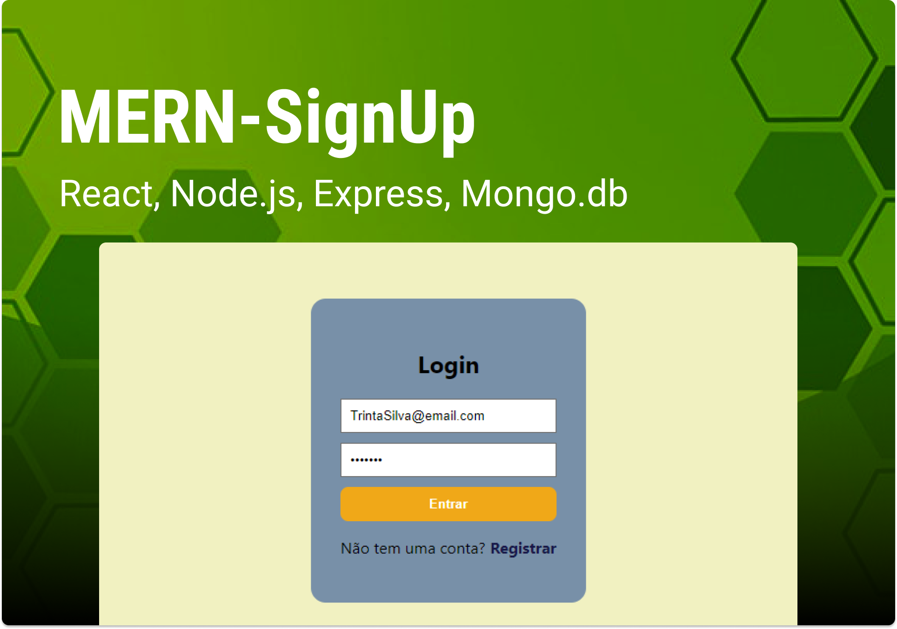

# TeamWork!

Here you can see and get a link to folders with projects i have contributed to as a team:

<table>
  <thead>
    <tr>
      <th align="center">
         
        
TITLE

      </th>
      <th align="center">
         
        
CREATED ON

      </th>
      <th align="center">
         
        
DESCRIPTION

      </th>
      <th align="center">
        
        
PREVIEW

      </th>
    </tr>
  </thead>
  <tbody>
    <tr align="center">
      <td><a href="https://github.com/Laysabernardes/ReservaDeChavesIFSP" target="blank">ReservaDeChavesIFSP</a></td>
      <td>Nov 5, 2023</td>
      <td>
        
A Website which IFSP students and teachers can logIn and send requests to an Administrator to reserve a campus classroom.

        
Created using: React.js, Node.js, Express and MySql

      </td>
      <td></td>
    </tr>
    <tr><td colspan="4"></td></tr>
    <tr align="center">
      <td><a href="https://github.com/LucasLoopsT/MERN-SignUp" target="blank">MERN-SignUp</a></td>
      <td>Oct 29, 2023</td>
      <td>
        
A simple SignUp and SignIn page.

        
Created using: React.js, Node.js, Express and Mongo.db.

      </td>
      <td></td>
    </tr>
    <tr><td colspan="4"></td></tr>
  </tbody>
</table>

---

🌌 By Lucas Loopst
